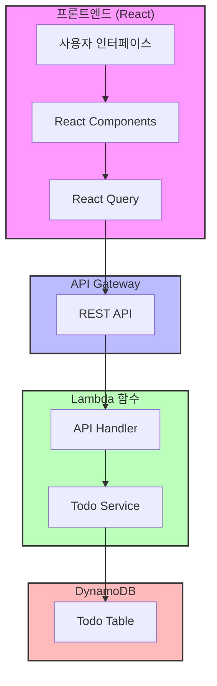
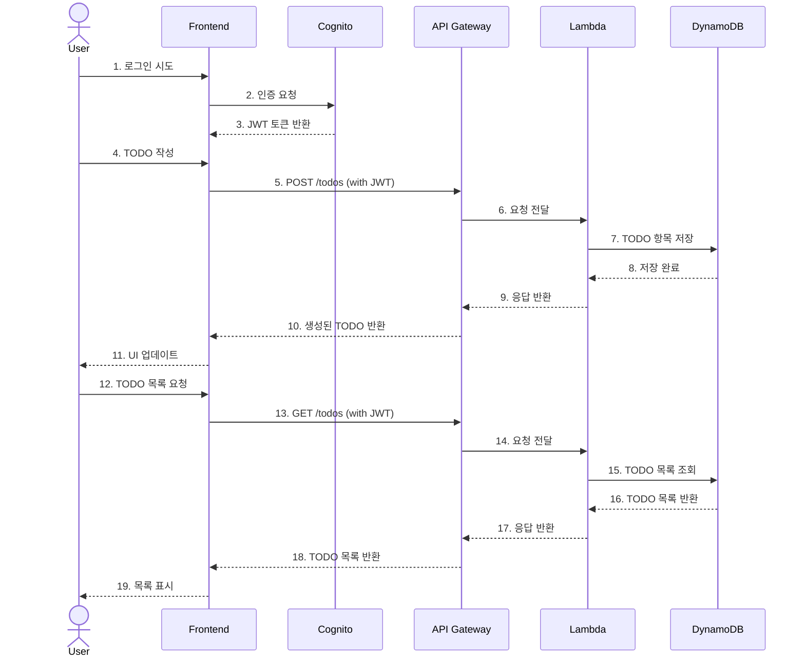
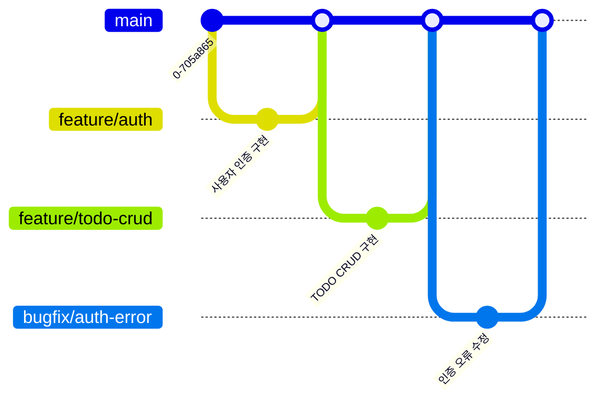

# 🚀 AWS Serverless TODO 애플리케이션

[](LICENSE)
[](https://github.com/awskrug/aiengineering-demo/stargazers)

AWS 서버리스 아키텍처를 활용한 현대적인 TODO 애플리케이션입니다. 이 프로젝트는 [2025년 1월 22일 있었던 AWS Korea User Group의 AI 엔지니어링 모임](https://www.meetup.com/awskrug/events/305372486/?slug=awskrug&eventId=305372486)에서 진행한 발표 내용의 일부로 라이브 코딩을 통해 제작되었습니다.

> 발표 장표: [CDD가 온다](https://bit.ly/3DRyxNA)

## ✨ 주요 기능

- 📝 TODO 항목 생성, 조회, 수정, 삭제
- 🔐 사용자 인증 (회원가입/로그인)
- 📱 반응형 디자인
- 🌐 서버리스 아키텍처

## 🛠️ 기술 스택

### 프론트엔드
- React.js
- TypeScript
- Material-UI
- React Query
- React Router

### 백엔드
- AWS CDK
- AWS Lambda
- Amazon DynamoDB
- Amazon Cognito
- Amazon API Gateway

## 🏗 시스템 아키텍처



### 시스템 상호작용



## 🚀 시작하기

### 사전 요구사항

- Node.js v18 이상
- AWS CLI 구성
- AWS CDK CLI 설치

### 설치 방법

1. 저장소 클론
```bash
git clone https://github.com/awskrug/aiengineering-demo.git
cd aiengineering-demo
```

2. 백엔드 배포
```bash
cd backend
npm install
npm run cdk deploy
```

3. 프론트엔드 실행
```bash
cd frontend
npm install
npm start
```

## 📚 프로젝트 문서

- [설계 문서](doc/design.md) - 프로젝트 아키텍처 및 기술 스택
- [작업 목록](doc/todo.md) - 개발 진행 상황 및 할 일 목록
- [데모 시나리오](doc/demo_scenario.md) - AI 엔지니어링 데모 진행 과정
- [보안 규정 준수](doc/compliance.md) - K-ISMS 요구사항 매핑

## 🌳 브랜치 관리

이 프로젝트는 [GitHub Flow](https://guides.github.com/introduction/flow/) 브랜치 전략을 따릅니다.

### 브랜치 전략 다이어그램



### 주요 브랜치
- `main`: 제품의 안정적인 버전을 관리하는 기본 브랜치
- `feature/*`: 새로운 기능 개발을 위한 브랜치
- `bugfix/*`: 버그 수정을 위한 브랜치

### 브랜치 네이밍 규칙
- 기능 개발: `feature/login`, `feature/todo-list`
- 버그 수정: `bugfix/auth-error`, `bugfix/api-timeout`

### 작업 프로세스
1. 새로운 작업 시작
   ```bash
   git checkout main
   git pull origin main
   git checkout -b feature/new-feature
   ```

2. 작업 중 주기적인 커밋
   ```bash
   git add .
   git commit -m "feat: 새로운 기능 구현"
   git push origin feature/new-feature
   ```

3. Pull Request 생성 및 리뷰
   - GitHub에서 Pull Request 생성
   - 코드 리뷰 진행
   - CI/CD 파이프라인 통과 확인

4. 작업 완료 및 병합
   ```bash
   # GitHub UI에서 "Merge pull request" 버튼 클릭
   git checkout main
   git pull origin main
   ```

### Pull Request 규칙
1. 제목 형식: `[타입] 작업 내용 요약`
   - 예: `[feat] 로그인 기능 구현`
   - 예: `[fix] 인증 오류 수정`

2. 타입 분류
   - `feat`: 새로운 기능
   - `fix`: 버그 수정
   - `docs`: 문서 수정
   - `style`: 코드 포맷팅
   - `refactor`: 코드 리팩토링
   - `test`: 테스트 코드
   - `chore`: 기타 작업

3. PR 템플릿
   ```markdown
   ## 작업 내용
   - 구현/수정한 내용을 상세히 기술

   ## 테스트 결과
   - 테스트 방법과 결과를 기술

   ## 참고 사항
   - 리뷰어가 알아야 할 내용을 기술
   ```

## 🤝 기여하기

1. Fork the Project
2. Create your Feature Branch (`git checkout -b feature/AmazingFeature`)
3. Commit your Changes (`git commit -m 'Add some AmazingFeature'`)
4. Push to the Branch (`git push origin feature/AmazingFeature`)
5. Open a Pull Request

## 📝 라이선스

이 프로젝트는 MIT 라이선스로 배포됩니다. 자세한 내용은 [LICENSE](LICENSE) 파일을 참조하세요.

## 👥 만든 사람들

- AWS Korea User Group AI Engineering 소모임

## 💬 문의하기

문의사항이나 제안사항이 있으시다면 GitHub Issues를 통해 알려주세요.
